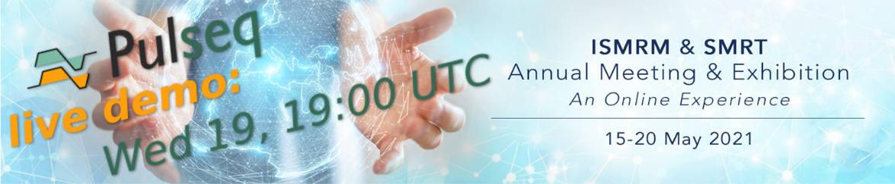

# ISMRM 2021 Live Demo

Welcome to the *Pulseq* live demo repository! This repository contain all supplimentary materials and links to raw data necessary to fully appreciate the live software demonstration at **19:00 UTC on Wednesday May 19**. 

## How to prepare to the session

In preparation to the demo please consider checking out the main *Pulseq* repository at https://github.com/pulseq/pulseq and familarizing yourself with the code, example sequences and reconstructon scripts (see 
[pulseq/matlab/demoSeq](https://github.com/pulseq/pulseq/tree/master/matlab/demoSeq) and [pulseq/matlab/demoRecon](https://github.com/pulseq/pulseq/tree/master/matlab/demoRecon)).

The [handout materials](Handout_Pulseq_demo_ismrm21_v2.pdf) to accompany the session are now available in the PDF format containing the slides from the presentation with some additional material and explanations. In particular, the second part of the document (page 18 and on) describe the code examples. Please keep in mind that these examples were specifically developed for the demo, so you might find some useful information there even if you are familiar with the previous versions of Pulseq. 

Source code of the demo sequences and reconstruction scripts is available in the [code](https://github.com/pulseq/pulseqISMRM2021/code) directory above. Please download the files to your computer and make them available to Matlab (e.g. by saving them in a subdirectory inside your Pulseq-Matlab installation and adding them to the Matlab's path). 

The pre-recoded raw MR data and the directory for sharing the measured raw data in real time will shared via a Dropbox. Corresponding Dropbox links will be announced here before the session.

**See you at the live demo!**

